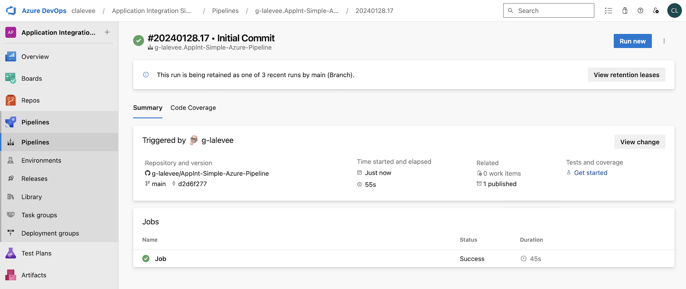

# Google Cloud Application Integration CI/CD using GitHub and Azure Pipeline


[](https://dev.azure.com/clalevee/Application%20Integration%20Simple%20Azure%20Pipeline/_build/latest?definitionId=10&branchName=main)
[](https://shields.io/) 

***

**This is not an official Google product.**
<BR>This implementation is not an official Google product, nor is it part of an official Google product. Support is available on a best-effort basis via GitHub.

****

## Presentation

Simple implementation of a CI/CD pipeline for Google Cloud Application Integration using
[Azure Pipeline](https://docs.microsoft.com/en-us/azure/devops/pipelines/get-started/what-is-azure-pipelines?view=azure-devops)  and the CLI tool [integrationcli](https://github.com/GoogleCloudPlatform/application-integration-management-toolkit).

The CICD pipeline includes:

- Deployment of an Integration Connectors using
  [integrationcli](https://github.com/GoogleCloudPlatform/application-integration-management-toolkit)
- Deployment of an Application Integration configuration using
  [integrationcli](https://github.com/GoogleCloudPlatform/application-integration-management-toolkit)
- Integration testing of the deployed Application Integration using [apickli](https://github.com/apickli/apickli)

> **NOTE:** Apickli uses the [Application Integration Location Integration Execute API](https://cloud.google.com/application-integration/docs/reference/rest/v1/projects.locations.integrations/execute) to call one trigger of the Integration deployed.


### Integration and Connection configuration

This sample includes a simple Application Integration flow implementing a CRUD scenario for a BigQuery table. It also includes the Application Connector definition.


The [`integrationcli scaffold`](https://github.com/GoogleCloudPlatform/application-integration-management-toolkit/blob/main/docs/integrationcli_integrations_scaffold.md) command  was used to generate this repository content as below:


```bash
├── azure-pipelines.yml
|   # the Azure Pipeline CI/CD configuration file
├── authconfigs
│   └── <authconfig-name>.json 
|       # there is one file per authconfig. 
|       # the authconfig name is the file name.
|       # NOT required for this sample
├── connectors
│   └── <connector-name>.json 
|       # there is one file per connector. 
|       # the connector name is the file name.
├── overrides
│   └── overrides.json 
|       # always name this overrides.json. 
|       # there is only one file in this folder
└── src
|   └── <integration-name>.json 
|         # there only one file in the folder. 
|         # the integration name is the file name.
└── tests
|   └── apickli
|     └── appint_tests
|       └── features
|         # apickli configuration files &
|         # *.feature Gherkin test files
└── package.json 
|   # the package.json file for apickli dependencies
└── bq-sample-data
    # Data and script to create BQ sample data 
    # (table used by Integration & Connection provided)


```


> The `integrationcli scaffold` command generates all the authconfigs, connector configuration and Integration (and [more](https://github.com/GoogleCloudPlatform/application-integration-management-toolkit/blob/main/docs/integrationcli_integrations_scaffold.md)) from a single command:


  ``` bash
  token=$(gcloud auth print-access-token)
  integrationcli integrations scaffold -n <integration-name> -s <snapShot> -p <project-id> -r <region-name> -t $token
  ```

> **NOTE:** Scaffodling **does not** export endpoint attchaments. They have to be added manually.


The Azure Pipeline provided uses the `integrationcli apply` command to apply the configurations generated by `integrationcli scaffold`.


## Requirements

- A GitHub Account
- A Microsoft Azure account (to create a pipeline linked to this GitHub repository, see [Azure DevOps Services](https://azure.microsoft.com/en-us/services/devops/)) 
- Application Integration and Integration Connectors services enabled and provisioned ([Set up Application Integration](https://cloud.google.com/application-integration/docs/setup-application-integration)).
- A GCP Service Account. The authentication to the Application Integration / Integration Connectors management API is done using a GCP Service Account. See [CI/CD Configuration Instructions](#CI/CD-Configuration-Instructions).


## CI/CD Configuration Instructions

### Google Cloud Service Account

Application Integration / Integration Connectors deployement requires a GCP Service Account with the following roles (or a custom role with all required permissions):

- Integration Admin
- Connector Admin

To create it in your GCP project, use following gcloud commands (or GCP Web UI):

```sh
SA_NAME=<your-new-service-account-name>

gcloud iam service-accounts create $SA_NAME --display-name="Azure Pipeline Service Account"

PROJECT_ID=$(gcloud config get-value project)
AZURE_SA=$SA_NAME@$PROJECT_ID.iam.gserviceaccount.com

gcloud projects add-iam-policy-binding "$PROJECT_ID" \
  --member="serviceAccount:$AZURE_SA" \
  --role="roles/integrations.integrationAdmin"

gcloud projects add-iam-policy-binding "$PROJECT_ID" \
  --member="serviceAccount:$AZURE_SA" \
  --role="roles/roles/connectors.admin"

gcloud iam service-accounts keys create $SA_NAME-key.json --iam-account=$AZURE_SA --key-file-type=json 

```

Copy `<your-new-service-account-name>-key.json` file content to clipboard. 


### GitHub repository

1.  **Create a GitHub repository to hold your Application Integration configuration** <BR>

    To use the `AppInt-Simple-Azure-Pipeline` follow these
steps:

    ```bash
    git clone git@github.com:g-lalevee/AppInt-Simple-Azure-Pipeline.git
    cd AppInt-Simple-Azure-Pipeline
    git init
    git remote add origin git@github.com:<MY-USER>/<MY-REPO>.git
    git checkout -b feature/cicd-pipeline
    git add .
    git commit -m "initial commit"
    git push -u origin feature/cicd-pipeline
    ```


### Azure Pipeline Configuration 

1.  Create a pipeline<BR>
In your [Azure DevOps account](https://dev.azure.com), create a new project. <BR>Then, from the **Pipelines** main menu, select **Pipeline** and select **GitHub**, then select your cloned repository as source repository. Terminate your pipeline configuration and save it.<BR>
Next step will be to add Apigee credentials to your pipeline. 


2.  Add pipeline variable `GCP_SERVICE_ACCOUNT`, to store your GCP Service Account json key:
    - Go to **Pipelines** menu, select your pipeline: **Edit** button, then **Variables** button to add variable.
    - Click the **+** button.<BR>In the New variable modal, fill in the details:
        - Key: GCP_SERVICE_ACCOUNT
        - Value: paste clipboard (containing GCP SA JSON key copied before)
        - Keep this value secret: checked
        - Click the **OK** button


### Big Query (option)

The Application Integration deployed by this sample exposes a BigQuery dataset and table containing a list of Airports and their IATA codes.
The `bq-sample-data` folder contains script and data to create IATA table in your BigQuery.

Update the `./bq-sample-data/setup_bigquery.sh` file with your values (don't change table name):

``` bash
export BQ_PROJECT_ID="YOUR_PROJECT"
export BQ_DATASET_ID="YOUR_DATASET"
export BQ_DATASET_LOCATION="YOUR_REGION"
```

Run the `./setup_bigquery.sh` shell script, from `bq-sample-data` folder, to create the Dataset and table. It also outputs the entries from the table which contains IATA codes and Airports names.
Output:

``` bash 
./bq-sample-data/setup_bigquery.sh

Create BQ table IATA using GCP project "xxxxx" and dataset "xxxxx"
Upload complete.
Waiting on bqjob_r2ff381b3bf76f9d8_0000018d2e9e284e_1 ... (0s) Current status: DONE   
+------------------------------------------+------+
|                 airport                  | code |
+------------------------------------------+------+
| Al Arish, Egypt                          | AAC  |
| Annaba, Algeria                          | AAE  |
| Arapoti, Brazil                          | AAG  |
| Aalborg, Denmark                         | AAL  |
| Al Ain, United Arab Emirates             | AAN  |
| Anapa, Russia                            | AAQ  |
| Aarhus, Denmark - Tirstrup               | AAR  |
...
| Aktyubinsk, Kazakhstan                   | AKX  |
| Almaty, Kazakhstan                       | AKX  |
| Sittwe, Myanmar                          | AKY  |
+------------------------------------------+------+

Table created
```

### Run the pipeline

Using your favorite IDE...
1.  Update the **azure-pipelines.yml** file<BR>
In global **Variables** section, change:
    - **GCP_PROJECT_ID** value by your target GCP project ID
    - **GCP_REGION** value by the target region to deploy to
    - **INTEGRATION_TARGET_NAME** the name the Integration will be deployed to (by default, `airports-integration-cicd`)
    - **CONNECTION_TARGET_NAME** the name the Integration will be deployed to (by default, `cl-bqdemos`)
2. Save
3. Update the **trigger.feature** Apickli file, in **tests** directory, to adapt Body and Result to your Integration data format and parameters (see [Application Integration Documentation](https://cloud.google.com/application-integration/docs/reference/rest/v1/projects.locations.integrations/execute) for Body requested format)
4. Save
5. Commit, Push.. et voila!

Use the Azure Pipeline UI to monitor your pipeline execution:
- Go to **Pipelines** menu, select the pipeline, and select the Runs section.
Click on the running build you want to monitor.

  

- The summary page displays builds summary and status. Click on running Job. You can see all steps running, and their logs

  

- When the build is over, click on the top-left arrow. Then, you see execution status and link to the artifact generated ("1 published")

  

- Click on artifact link, to access artifact folders and list. <BR>Click on **integration-tests** folder, then **apickli_report.html** to download it. Open apickli report with your browser :


  

